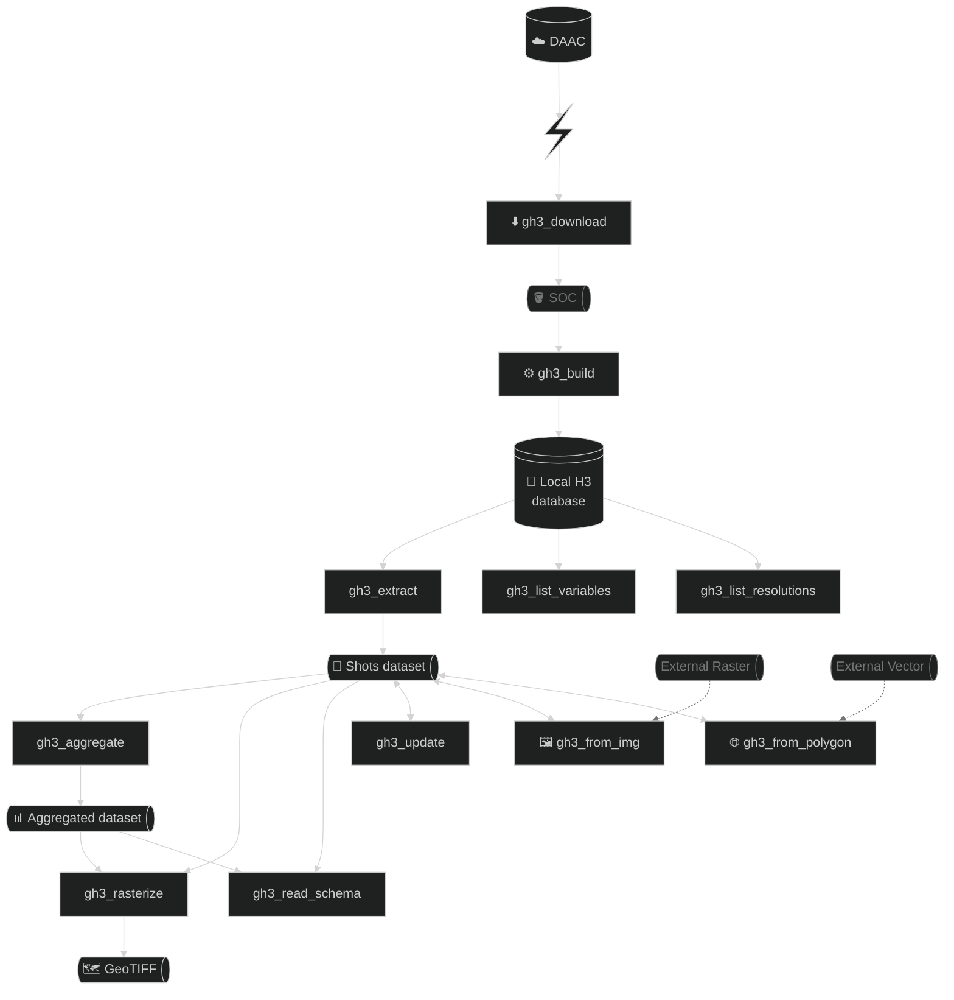

# gedih3

A Python library for downloading, indexing, querying, and rasterizing NASA's GEDI satellite LiDAR data using H3 hexagonal and EGI square pixel spatial indexing.

GEDI (Global Ecosystem Dynamics Investigation) produces billions of LiDAR footprints distributed across thousands of HDF5 granules. **gedih3** transforms this data into a spatially-indexed Parquet database that enables fast spatial and temporal queries, multi-resolution aggregation, raster export, and integration with external datasets -- all from the command line or Python API.

---

## Why gedih3?

Working with GEDI data at scale is hard: granules are organized by orbit (not geography), files are large HDF5 containers requiring specialized libraries, and spatial queries over billions of footprints need an indexing strategy. Manual workflows break down quickly.

**gedih3** solves this with:

- **Complete pipeline**: Download from NASA DAAC, build a spatial database, query/aggregate, and export rasters -- all in one package
- **Spatial indexing**: H3 hexagons (Uber's system) for flexible resolution queries + EGI square pixels (EASE-Grid 2.0) for GEDI L4B compatibility
- **Scale via Dask**: Distributed computing handles billion-row datasets across HPC clusters
- **Interoperable outputs**: Flat Parquet files work with R, QGIS, Python, or any Parquet-capable tool
- **Ancillary data fusion**: Sample external rasters and join vector polygons at the shot level
- **NASA Earthdata integration**: Authentication, search, download, and S3 streaming with automatic retry

---

## Key Features

- H3 hexagonal spatial indexing (levels 0-15) for efficient spatial queries
- EGI square pixel indexing (EASE-Grid 2.0, EPSG:6933) aligned with GEDI L4B products
- H3-to-raster and EGI-to-raster GeoTIFF export with time-series support
- Ancillary data tools: raster sampling (`gh3_from_img`) and vector spatial join (`gh3_from_polygon`)
- Dask distributed processing for large datasets
- Simplified flat Parquet output format for external tool compatibility
- 26 structured exception types for targeted error handling
- Atomic file writes with transaction safety
- NASA Earthdata access with exponential backoff retry logic
- Quality filtering, temporal windowing, and multi-product support (L1B, L2A, L2B, L4A, L4C)

---

## Quick Start

```bash
# Install
conda env create -f environment.yml
conda activate gedih3
pip install -e .

# 1. Download GEDI data for a region
gh3_download -r "-51,0,-50,1" -l2a default -l4a default -N 8

# 2. Build H3-indexed database
gh3_build -r "-51,0,-50,1" -l2a default -l4a default -h3r 12 -h3p 3

# 3. Extract filtered data
gh3_extract -d ~/gedih3_db -r region.shp -l4a agbd -q -o extracted/

# 4. Aggregate to coarser resolution
gh3_aggregate -d ~/gedih3_db -egi 6 -a mean -o aggregated/

# 5. Export as GeoTIFF
gh3_rasterize -d aggregated/ -o output/ --compress LZW
```

---

## CLI Tools

| Tool | Purpose |
|------|---------|
| `gh3_download` | Download GEDI data from NASA DAAC |
| `gh3_build` | Build H3-indexed Parquet database from HDF5 files |
| `gh3_extract` | Extract data with spatial/temporal filters (H3 or EGI output) |
| `gh3_aggregate` | Aggregate to coarser H3/EGI resolution levels |
| `gh3_rasterize` | Convert aggregated/extracted datasets to GeoTIFF |
| `gh3_update` | Add/merge variables to existing datasets |
| `gh3_from_img` | Sample external raster values at GEDI shot locations |
| `gh3_from_polygon` | Spatial join vector polygon attributes to GEDI shots |
| `gh3_list_variables` | List available GEDI variables with grep filtering |
| `gh3_list_resolutions` | Display H3 and EGI resolution level tables |
| `gh3_read_schema` | Inspect Parquet, GeoPackage, or HDF5 file schemas |

### Common Flags

```
-r, --region       Spatial filter: vector file, bbox "W,S,E,N", or ISO3 code
-d0, -d1           Temporal filters (YYYY-MM-DD)
-l2a, -l4a, ...    Product variables (use 'default', 'minimal', or explicit list)
-N, -T, -M         Dask workers, threads, memory per worker
-v / -vv / -Q      Verbosity: INFO / DEBUG / quiet
-egi INDEX[:PART]   Use EGI indexing (e.g., -egi 6 or -egi 6:12)
```

---

## Python API

```python
import gedih3.gh3driver as gh3

# Load H3-indexed data with spatial filter
ddf = gh3.gh3_load(
    columns=['agbd_l4a', 'rh_098_l2a'],
    region='region.shp',
    query='quality_flag_l2a == 1',
    gh3_dir='/path/to/database'
)

# Aggregate to coarser H3 level
agg_df = gh3.gh3_aggregate(ddf, target_res=6, agg='mean')

# Load simplified dataset (output of gh3_extract or gh3_aggregate)
gdf = gh3.gh3_load_dataset('/path/to/extracted/')

# EGI indexing
import gedih3.egi as egi
egi_df = egi.egi_dataframe(shots_df, level=6)

# Rasterization
from gedih3 import raster
xras = raster.h3_to_raster(h3_gdf, columns=['agbd_mean'])
raster.export_raster(xras, "output.tif", compress='LZW')

# Ancillary data: sample raster at shot locations
from gedih3.imgutils import from_image
ddf = from_image('/path/to/dem.tif', data_source='/path/to/database', region='region.shp')
```

---

## Architecture



**Output Formats**:
- **H3 Database**: Hive-partitioned Parquet optimized for repeated queries (`gh3_build`)
- **Simplified Dataset**: Flat Parquet files with `gedih3_dataset.json` metadata, designed for external tools (`gh3_extract`, `gh3_aggregate`, `gh3_from_img`, `gh3_from_polygon`)
- **GeoTIFF**: Raster output with compression, tiling, and BIGTIFF support (`gh3_rasterize`)

---

## GEDI Products Supported

| Product | Description |
|---------|-------------|
| L1B | Geolocated waveforms |
| L2A | Elevation and height metrics (RH percentiles) |
| L2B | Canopy cover and vertical profiles |
| L4A | Footprint-level aboveground biomass (AGBD) |
| L4C | Footprint-level structural complexity (WSCI) |

---

## Spatial Indexing

### H3 (Hexagonal Hierarchical Index)

Uber's H3 system for hexagonal spatial partitioning. Used as the primary index for the database.

| Level | Avg. Hex Area | Typical Use |
|-------|---------------|-------------|
| 0 | 4,250,547 km2 | Global |
| 3 | 12,393 km2 | Partition level |
| 6 | 36.13 km2 | Regional analysis |
| 9 | 0.105 km2 | Local analysis |
| 12 | 307 m2 | Index level (default) |
| 15 | 0.90 m2 | Maximum resolution |

### EGI (EASE Grid Index)

Square pixel indexing on EASE-Grid 2.0 (EPSG:6933) for compatibility with GEDI L4B gridded products.

| Level | Pixel Size | Typical Use |
|-------|------------|-------------|
| 1 | ~1 m | Finest resolution |
| 3 | ~25 m | GEDI footprint |
| 6 | ~1 km | GEDI L4B baseline |
| 8 | ~10 km | Wall-to-wall |
| 12 | ~160 km | Partition level (coarsest) |

> **Note**: Lower EGI level = finer resolution (opposite to H3).

---

## Configuration

Configuration priority (highest to lowest):
1. Command-line arguments
2. Environment variables (`GH3_DEFAULT_*`)
3. `~/.gedih3.env` file
4. Package defaults

```bash
# Environment variables
export GH3_DEFAULT_DOWNLOAD_DIR=/path/to/data
export GH3_DEFAULT_H3_DIR=/path/to/h3_database
export GH3_DEFAULT_SOC_DIR=/path/to/hdf5_files
export GH3_DEFAULT_TMP_DIR=/path/to/tmp
```

---

## Tutorials

See the `tutorials/` directory:
- `tutorial_cli_pipeline.sh` -- End-to-end CLI workflow
- `tutorial_python_api_pipeline.py` -- Python API examples

---

## Requirements

- **Python** >= 3.13 (tested with 3.10+; update `pyproject.toml` for older versions)
- **NASA Earthdata account** (for downloading GEDI data)
- **Key dependencies**: dask, geopandas, h3, pyarrow, h5py, rioxarray, earthaccess

See `pyproject.toml` for the full dependency list.

---

## License

TBD
