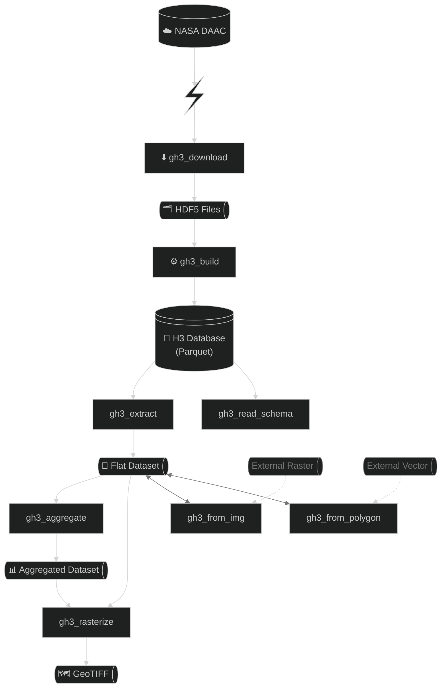

# gedih3

**Turn billions of NASA GEDI LiDAR footprints into analysis-ready spatial datasets — from the command line or Python.**

GEDI (Global Ecosystem Dynamics Investigation) is NASA's premier spaceborne LiDAR mission, measuring forest structure and carbon stocks globally. Its raw data comprises thousands of large HDF5 files organized by satellite orbit — not by geography. Navigating quality flags, extracting variables of interest, and running spatial queries over billions of footprints requires significant engineering effort and domain expertise.

**gedih3** handles all of that. It converts orbit-organized GEDI HDF5 files into a spatially-indexed GeoParquet database built with expert-curated presets and pre-configured quality filtering, then provides a complete toolchain for querying, aggregating, and exporting to GeoTIFF, GeoParquet, and other common formats.

---

## What is GEDI-H3?

gedih3 is built on four components that together make billion-shot GEDI analysis tractable:

| Component | Role |
|-----------|------|
| **[GEDI](https://gedi.umd.edu/)** | NASA ISS-mounted LiDAR measuring forest height, biomass, and canopy structure at ~25 m footprints globally |
| **[H3](https://h3geo.org/)** | Uber's hexagonal spatial indexing system — the primary database index enabling fast regional queries |
| **[Dask](https://dask.org/)** | Distributed Python computing — scales from a laptop to an HPC cluster without changing your code |
| **[earthaccess](https://earthaccess.readthedocs.io/)** | NASA's official library for Earthdata authentication, search, and download |

---

## Why gedih3?

Working with GEDI at scale is genuinely hard:

- **Orbit-organized, not spatially indexed** — files are sorted by acquisition time, not geography. A regional query means scanning thousands of files.
- **Complex HDF5 containers** — deeply nested structure with hundreds of variables per beam, requiring specialized tools to navigate correctly.
- **Quality filtering is non-trivial** — each product has its own flags; best practices require combining multiple criteria correctly to avoid biased results.
- **Variable overload** — L2A alone provides 300+ variables per beam. Choosing the right ones for your analysis requires domain expertise.
- **Scale** — the full dataset runs to terabytes and billions of rows. Without spatial indexing and distributed processing, even simple analyses can take days.

**gedih3** addresses all of this:

- **Expert-curated variable presets** — `minimal` and `default` sets for each product, designed by remote sensing scientists for common use cases.
- **Pre-configured quality filtering** — scientifically-validated filters applied with a single flag (`-y`), following community best practices.
- **Spatial indexing from first principles** — H3 hexagonal database enables fast regional queries after a one-time build step.
- **Full pipeline in one package** — download → build → query → aggregate → export, all from the CLI or Python.
- **Analysis-ready outputs** — flat GeoParquet, GeoTIFF, and other formats compatible with R, QGIS, Python, and DuckDB.

---

## Key Features

- Complete data pipeline: download, build, extract, aggregate, rasterize — 11 CLI tools
- Expert-curated `minimal` and `default` variable presets for all GEDI products (L1B, L2A, L2B, L4A, L4C)
- Pre-configured quality filtering with a single flag
- H3 hexagonal spatial indexing (levels 0–15) for fast regional queries
- Dask-distributed processing — works on laptops, workstations, and HPC clusters
- DuckDB compatible for fully featured spatial SQL querying, including larger-than-memory queries
- Full Python API — chain operations in memory, no intermediate files required
- Custom aggregation functions — pass any Python callable (e.g., per-hexagon regression models)
- GeoTIFF export with compression, tiling, and time-series support
- NASA Earthdata integration: authenticated downloads with retry logic and S3 streaming
- Ancillary data fusion: sample external rasters and join vector polygons at shot level

---

## Quick Start

```bash
# Install
git clone https://github.com/tiagodc/GEDI-H3.git
cd GEDI-H3
conda env create -f environment.yml
conda activate gedih3
```

No configuration needed. All outputs default to `~/gedi_data/`.

```bash
# 1. Download GEDI data for a region (W,S,E,N)
gh3_download -r "-51,0,-50,1" -l2a minimal -l4a minimal

# 2. Build the H3 spatial database
gh3_build -r "-51,0,-50,1" -l2a minimal -l4a minimal
## Optionally build DuckDB metadata table (Ducklake)
gh3_build_ducklake

# 3. See which variables are available
gh3_read_schema

# 4. Extract with quality filtering
gh3_extract -y -l agbd_l4a rh_098_l2a -o extracted/

# 5. Aggregate to ~36 km² hexagons
gh3_aggregate -d extracted/ -h3 6 -a mean -o aggregated/

# 6. Export as GeoTIFF
gh3_rasterize -d aggregated/ -o rasters/ --compress LZW
```

> Run any tool with `--help` for the full list of options and flags:
> ```bash
> gh3_build --help
> gh3_aggregate --help
> ```

---

## CLI Tools

| Tool | Purpose |
|------|---------|
| `gh3_download` | Download GEDI HDF5 data from NASA DAACs |
| `gh3_build` | Build H3-indexed Parquet database from HDF5 files |
| `gh3_build_ducklake` | Build DuckDB metadata database for SQL queries |
| `gh3_extract` | Extract and filter shots to flat Parquet files |
| `gh3_aggregate` | Aggregate to coarser H3 resolution |
| `gh3_rasterize` | Export aggregated data as GeoTIFF |
| `gh3_update` | Merge new variables into an existing dataset |
| `gh3_from_img` | Sample external raster values at GEDI shot locations |
| `gh3_from_polygon` | Join vector polygon attributes to GEDI shots |
| `gh3_list_resolutions` | View H3 and EGI resolution level tables |
| `gh3_read_schema` | Inspect schemas and browse variables from any file or database |

### Common Flags

```
-r, --region       Spatial filter: bbox "W,S,E,N", vector file, or ISO3 country code
-t0, -t1           Temporal filters (YYYY-MM-DD)
-l2a, -l4a, ...    Product variables: 'minimal', 'default', or explicit variable names
-y, --quality      Apply pre-configured quality filters
-q, --query        Pandas query string filter
-N, -T, -M         Dask workers, threads per worker, memory per worker
-v / -vv / -Q      Verbosity: INFO / DEBUG / quiet
```

---

## Python API

All CLI functionality is available from Python — with the added benefit of chaining operations in memory without saving intermediate files to disk.

```python
import gedih3.gh3driver as gh3
from gedih3 import raster

# Load data from the H3 database
ddf = gh3.gh3_load(
    source='~/gedi_data/h3/',
    columns=['agbd_l4a', 'rh_098_l2a'],
    region='-51,0,-50,1',           # bbox, shapefile, or ISO3
    query='quality_flag_l2a == 1',
)

# Aggregate to H3 level 6 (~36 km²) and export as GeoTIFF
agg = gh3.gh3_aggregate(ddf, target_res=6, agg='mean').compute()
raster.export_raster(raster.h3_to_raster(agg), 'agbd_mean.tif', compress='LZW')
```

### Custom Aggregation Functions

The Python API accepts any callable as the aggregation function. Each H3 hexagon's data is passed as a DataFrame, enabling analyses not possible from the CLI:

```python
import numpy as np, pandas as pd
from sklearn.linear_model import LinearRegression
from sklearn.metrics import r2_score

def fit_regression(df):
    """Fit height → biomass regression per hexagon."""
    mask = ~(df['agbd_l4a'].isna() | df['rh_098_l2a'].isna())
    X, y = df.loc[mask, 'rh_098_l2a'].values.reshape(-1, 1), df.loc[mask, 'agbd_l4a'].values
    if len(X) < 2:
        return pd.DataFrame({'r2': [np.nan], 'n': [len(df)]})
    model = LinearRegression().fit(X, y)
    return pd.DataFrame({'r2': [r2_score(y, model.predict(X))], 'n': [len(df)]})

# Per-hexagon regression across all partitions, in parallel
results = gh3.gh3_aggregate(ddf, target_res=6, agg=fit_regression)
results.compute()
```

---

## Spatial Indexing

### H3 Hexagonal Index

H3 is the primary spatial index. The database uses a dual-level H3 structure: a coarse **partition level** (default: level 3, ~12,000 km²) for file organization, and a fine **index level** (default: level 12, ~307 m²) for shot-level precision.

| Level | Avg. Area | Typical Use |
|-------|-----------|-------------|
| 3 | ~12,393 km² | Partition level (database tiles) |
| 6 | ~36 km² | Regional aggregation |
| 9 | ~0.105 km² | Local analysis |
| 12 | ~307 m² | Index level (shot precision) |

> **Note**: H3 parent hexagons are not perfectly geometrically inclusive of their children — a known property of hexagonal grids. `gh3_aggregate` handles this correctly and consistently.

### EGI Square-Pixel Index (Advanced)

For workflows that require alignment with standard raster grids or the GEDI L4B gridded product, gedih3 supports the **EASE Grid Index (EGI)** — square pixels on EASE-Grid 2.0 (EPSG:6933).

| Level | Pixel Size | Typical Use |
|-------|------------|-------------|
| 3 | ~25 m | GEDI footprint level |
| 6 | ~1 km | GEDI L4B baseline |
| 8 | ~10 km | Wall-to-wall analysis |

> **Note**: Lower EGI level = finer resolution (opposite of H3).

```bash
# EGI extraction and aggregation
gh3_extract -d ~/gedi_data/h3/ -egi 6 -o extracted_egi/
gh3_aggregate -d ~/gedi_data/h3/ -egi 6 -a mean -o aggregated_egi/
```

---

## Architecture



---

## GEDI Products Supported

| Product | Description |
|---------|-------------|
| L1B | Geolocated waveforms |
| L2A | Elevation and height metrics (RH percentiles, canopy height) |
| L2B | Canopy cover and vertical structure profiles |
| L4A | Footprint-level aboveground biomass (AGBD) |
| L4C | Footprint-level structural complexity (WSCI) |

For variable details, run `gh3_read_schema` or see [gedi.umd.edu](https://gedi.umd.edu/dataproducts/download/).

---

## Configuration

gedih3 works with zero configuration. All outputs default to `~/gedi_data/`.

To customize storage locations, set environment variables or create `~/.gedih3.env`:

```bash
GH3_DEFAULT_DOWNLOAD_DIR=/data/gedi       # root for all gedih3 files
GH3_DEFAULT_H3_DIR=/data/gedi/h3_db       # H3 database location
GH3_DEFAULT_SOC_DIR=/data/gedi/soc        # downloaded HDF5 files
GH3_DEFAULT_TMP_DIR=/data/gedi/tmp        # temporary storage
```

Configuration priority (highest to lowest): CLI arguments → environment variables → `~/.gedih3.env` → package defaults.

---

## Tutorials

See the `tutorials/` directory:
- `tutorial_cli_pipeline.sh` — End-to-end CLI workflow
- `tutorial_python_api_pipeline.py` — Complete Python API examples
- `tutorial_duckdb_basics.ipynb` -- DuckDB query examples

---

## Requirements

- Python >= 3.12
- NASA Earthdata account (free, required for downloading GEDI data)
- Key dependencies: `dask`, `geopandas`, `h3`, `pyarrow`, `h5py`, `rioxarray`, `earthaccess`
- **Optional dependencies**: duckdb

See `pyproject.toml` for the full dependency list.

---

## License

This project is licensed under the [MIT License](LICENSE).
